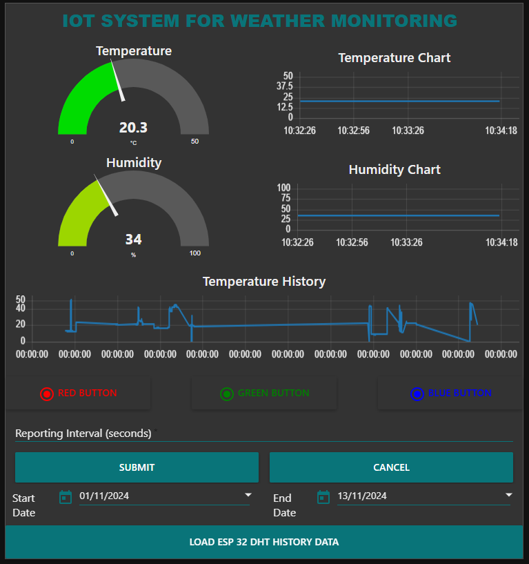

# ESP32 IoT System for Weather Monitoring

## Overview
This project demonstrates an IoT system using ESP32 and a DHT11 sensor to monitor weather conditions (Temperature and Humidity) and control an RGB LED based on temperature thresholds. Data is transmitted via MQTT, and a Node-RED dashboard provides real-time visualization and control.

## Features
- Collects temperature and humidity data.
- Visualizes data on a Node-RED dashboard.
- Controls RGB LED based on temperature thresholds.
- Adjustable reporting interval for MQTT data.
- Temperature threshold alert system.

## Hardware Requirements
- ESP32 microcontroller
- DHT11 temperature and humidity sensor
- RGB LED (Red, Green, Blue pins) `Common cathode Type`

## Setup Instructions
1. **Connect ESP32**:
   -Setup your connection to your desired pin ie.
   - Red LED -> GPIO 33
   - Green LED -> GPIO 26
   - Blue LED -> GPIO 25
   - DHT11 Data -> GPIO 4

3. **Install Libraries** in Arduino IDE:
   - `WiFi.h`, `DHT.h`, `ArduinoJson.h`, and `PubSubClient.h`

4. **Configure Code**:
   - Update `ssid` and `pass` variables with your Wi-Fi credentials.
   - Configure MQTT broker details and modify your device ID and other MQTT details to your unique identifier style if necessary.

5. **Upload Code**:
   - Upload `esp_32_environmental_monitoring.ino` file to your ESP32.
   
   **Arduino Code**: [Code](src/esp32_weather_monitoring_code/esp32_weather_monitoring_code.ino)
6. **Run MongoDB**:
   - Install MongoDB Community Edition on your PC and launch it.
  
7. **Run Node-RED Dashboard**:
   - Launch Node-Red
   - Install the following modules from the manage palette `node-red-node-mongodb`version 0.2.5, `node-red-dashboard`, `node-red-contrib-mqtt-broker`.
   - Import the dashboard flow JSON files provided.
   - Configure MQTT nodes to connect to the same broker as the ESP32.
   - Click `Deploy` to run, and open the user interface to view the Dashboard.
  ### Node-RED Flow 1
  
  
  **Node-RED Flow 1**: [Import JSON File](dashboard/all_flow.json)
  
  ### Node-RED Flow 2
  
  
  **Node-RED Flow 2**: [Import JSON File](dashboard/led_flow.json)

## Code Explanation
- **Sensor Readings**: Collects data from DHT11 and publishes to MQTT.
- **LED Control**: Adjusts LED colors based on temperature thresholds (e.g., red for hot, blue for cold).
- **Callback Functions**: Listens for incoming MQTT messages to update LED status and reporting interval.

## Usage
- Start the Node-RED dashboard to view real-time temperature and humidity data.
- Control RGB LED remotely through the Node-RED dashboard.

## Testing and Results
### Testing:
- **MQTT Connection**: Verifies stable connection and data transfer.
- **Sensor Accuracy**: Cross-references readings with known temperature and humidity values.
- **LED Response**: Ensures LED color changes correctly according to temperature and the web-based button.
- **Interval Update**: Checks that reporting interval timing updates when changes are effected.

### Results:
- Real-time environmental data displayed on Node-RED.
- Successful remote control of RGB LED via MQTT.
- Sucess high temperature threshold alert info.
- Successful reporting interval.
  
  
  
  
  
  

## Video Demonstration
- To watch the live demonstration of the system click the link.
[Watch the Video](https://heriotwatt-my.sharepoint.com/:v:/g/personal/dao2000_hw_ac_uk/EQsBSx4xS4FNu2JvZF7e7IABBts5R9t7jGJgGIy6Y1GP9Q?nav=eyJyZWZlcnJhbEluZm8iOnsicmVmZXJyYWxBcHAiOiJPbmVEcml2ZUZvckJ1c2luZXNzIiwicmVmZXJyYWxBcHBQbGF0Zm9ybSI6IldlYiIsInJlZmVycmFsTW9kZSI6InZpZXciLCJyZWZlcnJhbFZpZXciOiJNeUZpbGVzTGlua0NvcHkifX0&e=KBFObM)

  
